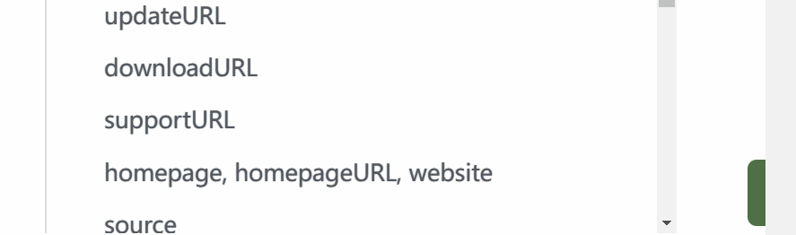
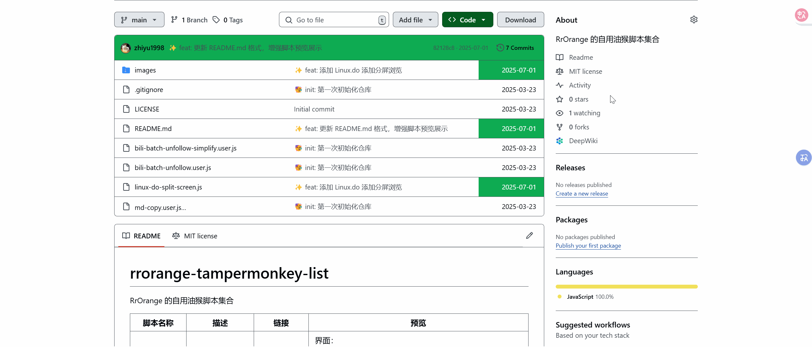

# RrOrange 的自用油猴脚本集合

| 脚本名称 | 描述 | 链接 | 预览 |
|----------|------|------|------|
| 哔哩哔哩批量自动取消关注 | 批量自动取消关注的脚本 | [GreasyFork](https://greasyfork.org/zh-CN/scripts/530598-bilibili%E6%89%B9%E9%87%8F%E5%8F%96%E6%B6%88%E5%85%B3%E6%B3%A8%E8%84%9A%E6%9C%AC) / [精简版](bili-batch-unfollow-simplify.user.js) | 
界面：  操作效果： 
 |
| 快速复制当前网站为 MD（标题、链接） | 快速复制当前网站为 Markdown 格式的脚本 | [GreasyFork](https://greasyfork.org/zh-CN/scripts/530599-%E7%81%B5%E5%8A%A8-md-%E9%93%BE%E6%8E%A5%E5%A4%8D%E5%88%B6) | 

 |
| Linux.do 左右分栏浏览 | Linux.do 论坛的左右分栏浏览功能，支持调整宽度 | [本地脚本](linux-do-split-screen.js) | 

 |
| 网页地址发送到Telegram | 使用快捷键`(Alt + T)`将当前网页地址通过Telegram机器人发送给自己 | [本地脚本](send-to-tg.js) | 

 |
